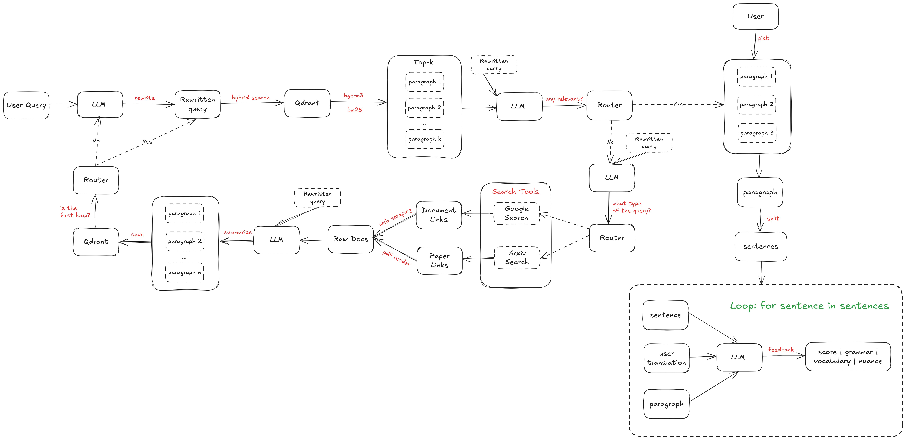

# AI-Coach: Synthesis & Translation Practice Engine

An intelligent agent that researches topics, learns from new information, and helps you improve your English writing through translation practice.

## About The Project

This project is a full-stack application designed to be a powerful personal assistant for both research and language learning. It operates in two primary modes:

1.  **Synthesis Engine (Deep Search):** An autonomous agent that performs research on a given query. It leverages a Retrieval-Augmented Generation (RAG) workflow, first checking its internal knowledge base (a Qdrant vector database) before searching the web and Arxiv for new information. It processes and learns from new findings, saving summaries back to its memory.

2.  **AI Writing Coach (Translation Practice):** An interactive interface designed to improve a user's Vietnamese-to-English translation skills. Users can select a Vietnamese passage, translate it sentence-by-sentence, and receive detailed, structured feedback from an AI examiner, including a numerical score and categorized comments on grammar, vocabulary, and nuance.

The entire process is visualized through a modern, real-time web interface.

---

## Key Features

* **Intelligent Research Agent**
    * Built with Python, FastAPI, and **LangGraph** for complex, stateful, multi-step workflows.
    * **Retrieval-Augmented Generation (RAG):** Checks its own **Qdrant** vector database for existing knowledge before performing external searches.
    * **Autonomous Web & Arxiv Search:** Gathers and processes new information from the internet and academic papers.
    * **Continuous Learning:** Summarizes new findings and saves them back to its vector memory for future use.

* **AI Translation Coach**
    * Interactive UI for translating Vietnamese passages into English, sentence by sentence.
    * **Structured Feedback:** Powered by a Google Gemini LLM, it provides a 0-100 score, plus categorized comments on grammar, vocabulary, and style.
    * **Dynamic UI:** The interface provides instant visual feedback on translation quality.

* **Real-time Frontend**
    * Modern frontend built with **React** and **Vite**.
    * Multi-page application structure managed by **React Router**.
    * A real-time execution log powered by a **FastAPI WebSocket** backend, showing the agent's thought process step-by-step.

---

## Tech Stack

* **Backend:** Python, FastAPI, LangChain, LangGraph, Qdrant, Google Gemini
* **Frontend:** React, Vite, React Router, CSS
* **Database:** Qdrant (Vector Database)

---

